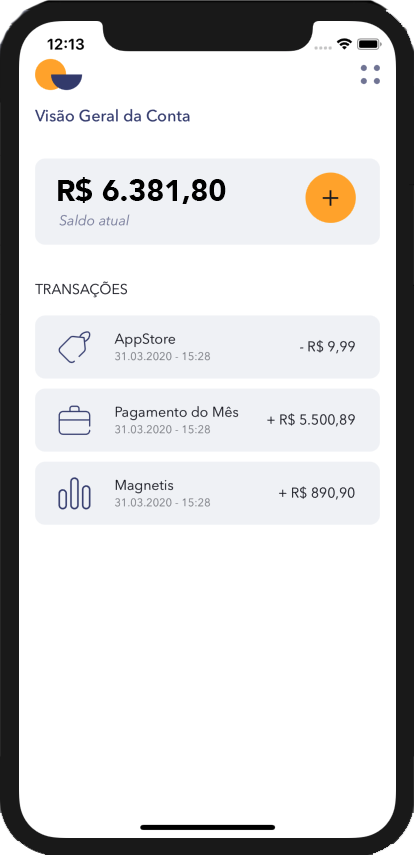

# eWallet - React Native Project
> eWallet is a digital financial control solution.

[![NPM Version][npm-image]][npm-url]
[![Build Status][travis-image]][travis-url]
[![Downloads Stats][npm-downloads]][npm-url]



## Installation

Android:

```sh
npm install or yarn 
```
```sh
npx react-native link 
```

iOS:

```sh
npm install or yarn
```

```sh
cd ios pod install cd..
```

```sh
npx react-native link 
```
obs: cduse react-native link for connect custom font

NOTE: if you use localhost data 

```sh
json-server server.json -p 3333
```


## Usage example

register your expenses and income in a simple, quick and easy way add the name of the transaction, enter the amount and what it is also enter a category and that's it._

Ex:

Rent => R $ 550.00 => Expense => Bills

## Release History

* 0.2.0
    * CHANGE: Update `docs`
* 0.1.1
    * FIX: Same bugs and code
* 0.1.0
    * The first proper release
* 0.0.1
    * Work in progress

## Meta

Marilia Vilas Boas – marilia.isabellaz@gmail.com

## Contributing

1. Clone the project (<https://marivb@bitbucket.org/marivb/finance_app.git>)
2. Create your feature branch (`git checkout -b feature/fooBar`)
3. Commit your changes (`git commit -am 'Add some fooBar'`)
4. Push to the branch (`git push origin feature/fooBar`)
5. Create a new Pull Request

<!-- Markdown link & img dfn's -->
[npm-image]: https://img.shields.io/npm/v/datadog-metrics.svg?style=flat-square
[npm-url]: https://npmjs.org/package/datadog-metrics
[npm-downloads]: https://img.shields.io/npm/dm/datadog-metrics.svg?style=flat-square
[travis-image]: https://img.shields.io/travis/dbader/node-datadog-metrics/master.svg?style=flat-square
[travis-url]: https://travis-ci.org/dbader/node-datadog-metrics
[wiki]: https://github.com/yourname/yourproject/wiki
